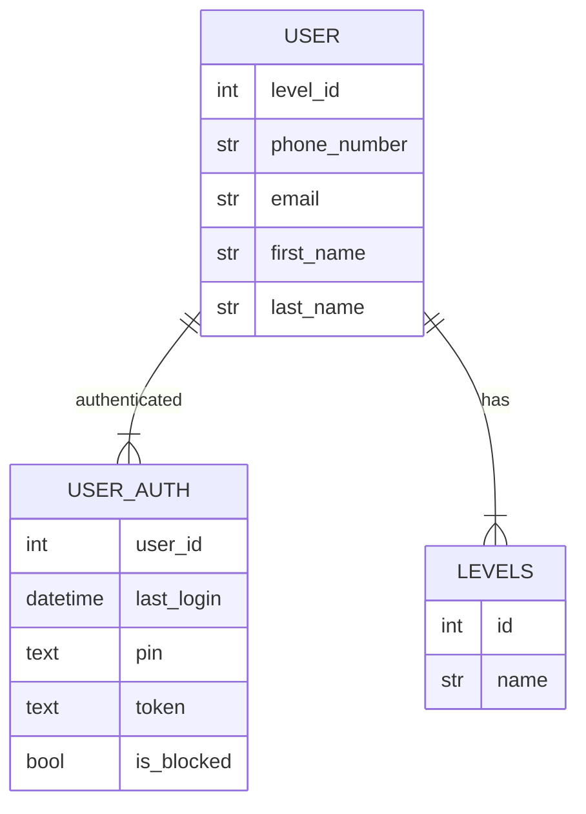
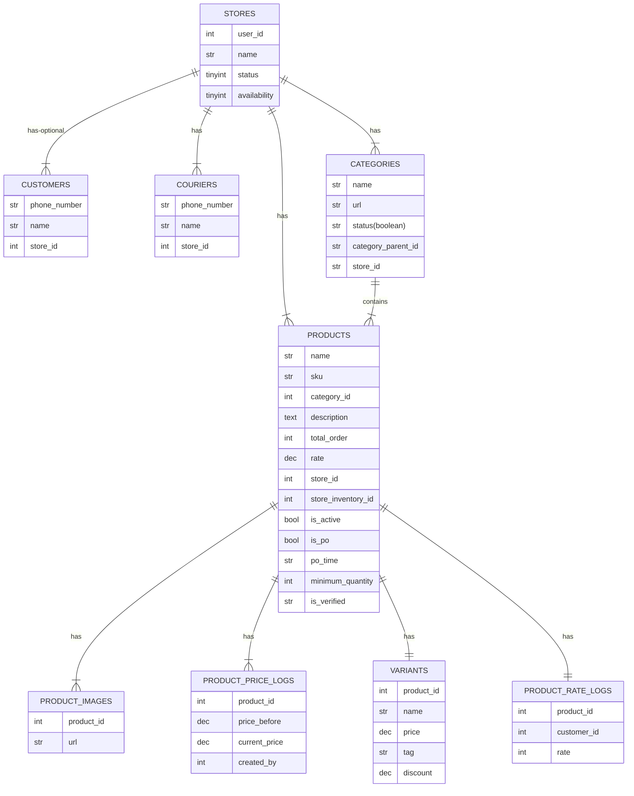
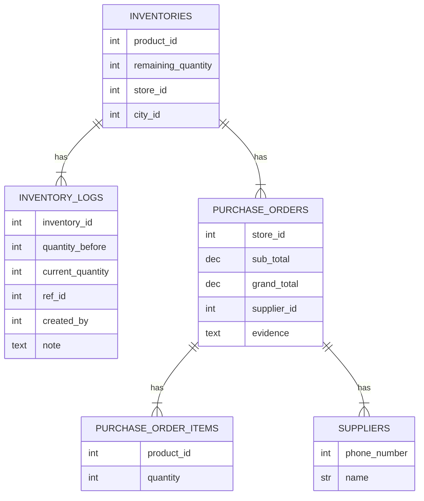
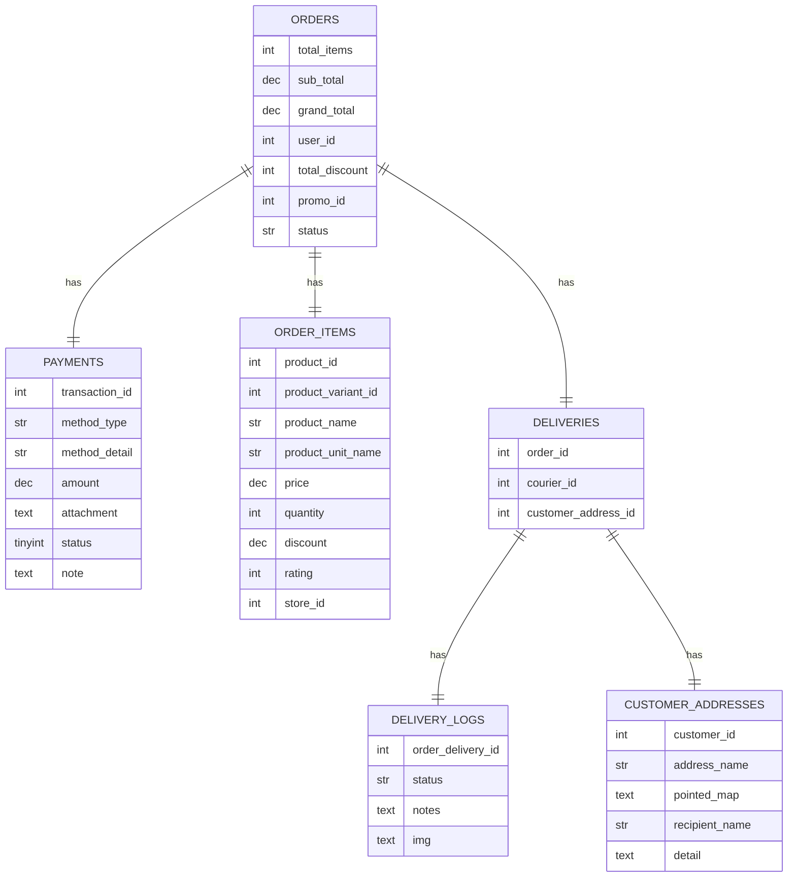

# Documentation

## Mindmap
Here is our documentation for mindmap
[Miro Link](https://miro.com/app/board/uXjVNwdDq-A=/?share_link_id=179473580058)

## ERD Plan
#### Gateway Service

#### Store Service

#### Inventory Service

#### Order Service

